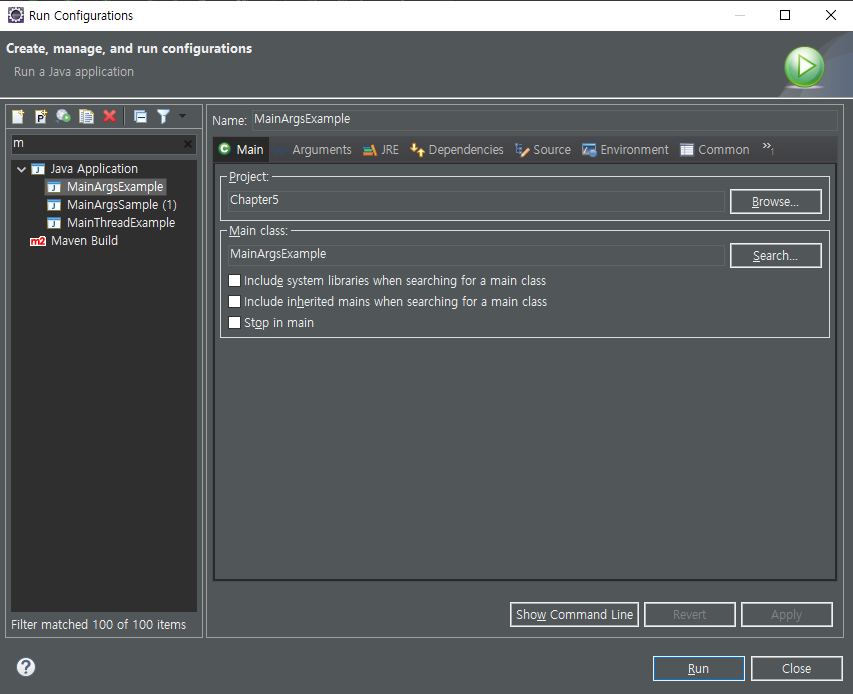

# 💡 참조 타입 (이어서)
## 4. String 타입
### String 타입 사용 방법
👉 자바는 문자열을 String 변수에 저장하므로, String 변수를 먼저 선언하고 큰따옴표로 감싼 문자열 리터럴을 대입한다.
> #### String 타입 사용 예시
```java
// 예시1					// 예시2
String name;				String hobby = "programming";
name = "java";
```

### String 타입 특징
**📌 String 변수는 스택 영역, 문자열은 String 객체로서 힙 영역에 생성된다!**

- 문자열 리터럴이 동일하면 String 객체도 같다.
- new 연산자를 사용하면 문자열이 같더라도 객체는 각각 생성된다.
- String 변수도 참조 타입이므로 초기값으로 null을 대입할 수 있으나, JVM에서 자동으로 쓰레기 객체로 취급하여 제거해버린다.

## 5. 배열 타입
### 5-1. 배열
> #### 배열이란?
> 👉 같은 타입의 많은 데이터를 연속된 공간에 저장하는 자료구조로 인덱스를 사용한다!

- 배열은 객체로서 힙 영역에 생성되고, 배열 변수는 배열 객체를 참조한다.
- 배열 타입도 참조 타입에 속하므로 null로 초기화할 수 있다.
- **장점:** 변수 선언을 여러 번 할 필요가 없으며 반복문을 사용해서 많은 양의 데이터를 쉽게 처리할 수 있다.
- **단점:** 같은 타입의 데이터만 저장할 수 있고, 배열의 길이를 생성할 때 이미 결정하기 때문에 나중에 변경할 수 없다.

#### 배열 생성 방법
- 배열 변수를 선언한 다음에 값 목록이나 new 연산자로 배열을 생성할 수 있다.
- 값 목록은 배열에 넣을 값이 정해져 있을 때에 사용할 수 있고, new 연산자는 값은 정해져 있지 않지만 배열의 길이가 정해져 있을 때 사용할 수 있다.

> #### 배열 생성 예시
```java
// 값 목록으로 배열을 생성하는 예시1
int[] arry1 = {30, 10, 20};

// 값 목록으로 배열을 생성하는 예시2
int[] arry2;
arry2 = new int[] {30, 10, 20}

// new 연산자로 배열을 생성하는 예시1
int[] arry3 = new int[10];

// new 연산자로 배열을 생성하는 예시2
int[] arry4;
arry4 = new int[10];

// new 연산자로 배열을 생성하는 예시3
int[] arry5 = null;
arry5 = new int[20];
```

**📌 값 목록으로 배열 생성 시 주의할 점**
메소드의 매개값이 배열일 때와 배열 변수를 먼저 선언한 다음에 배열 변수에 값 목록으로 배열을 생성할 때에는 new 연산자를 반드시 써야 한다!

```java
int[] arry;
arry = {30, 10, 20};  // 컴파일 에러!!
```

### 5-2. 배열의 활용
#### 배열의 길이와 for문
- 배열의 길이: 배열에 저장할 수 있는 전체 항목 수
- 배열의 길이는 for문의 조건식에서 주로 활용하며, 이는 정말 많이 쓰인다.

> 배열의 길이를 구하는 방법?
> 👉 배열변수.length

#### 커맨드 라인 입력
- 자바 실행 시, JVM은 길이가 0인 String 배열을 먼저 생성해서 main() 메소드를 호출할 때 매개값으로 전달한다.
- 커맨드 라인 입력은 자바의 main() 메소드의 매개값인 String[] args를 활용한다.

> #### 커맨드 라인 입력 활용 예시
1. main(String[] args)로 사칙연산을 할 수 있는 코드 짜기
```java
public class MainArgsExample {
	public static void main(String[] args) {
		int val1 = Integer.parseInt(args[0]);
		int val2 = Integer.parseInt(args[2]);
		String op = args[1];
		switch(op) {
		case "+": System.out.println(args[0] + args[1] + args[2] + "=" + (val1+val2)); break;
		case "-": System.out.println(args[0] + args[1] + args[2] + "=" + (val1-val2)); break;
		case "x": System.out.println(args[0] + args[1] + args[2] + "=" + (val1*val2)); break;
		case "/": System.out.println(args[0] + args[1] + args[2] + "=" + (val1/val2)); break;
		}
	}
}
```
2. Run Configuration 창 열기
    

3. Arguments탭의 Program arguments에 연산식 입력하고 Run 버튼 누르기
    
-1612425871235.png)
    
4. 콘솔창으로 결과 확인하기

     .png)

### 5-3. 다차원 배열
- 자바는 1차원 배열을 이용하여 수학의 행렬과 같은 방식으로 2차원 배열을 구현할 수 있다.
- 가로 인덱스가 행, 세로 인덱스가 열이 된다.

> #### 다차원 배열 생성 예시
```java
int[][] array = new int[2][3];
```

- 다차원 배열은 각 배열의 길이를 구할 때 주의해야 한다!

> #### 다차원 배열의 길이 예시
```java
int[][] array2 = new int[2][3];
array2.length = 2  // array2 = new int[][] {array2[0], array2[1]}임을 기억하자.
array2[0].length = 3  // array2[0] = new int[3];과 같다!
array2[1].length = 3  // array2[1] = new int[3];과 같다!
```

### 5-4. 객체를 참조하는 배열과 배열 복사
#### 객체를 참조하는 배열
각 항목에 직접 값을 갖고 있는 기본 타입과 달리, 참조 타입(클래스와 인터페이스) 배열은 각 항목에 값을 참조할 번지를 갖고 있다.
예) String 배열
> #### 객체를 참조하는 배열의 예시
```java
public class RefArrayExample {
	public static void main(String[] args) {
		String[] strarry = new String[3];
		strarry[0] = "Hello";
		strarry[1] = "Java";
		strarry[2] = "!";		
	}
}
```

#### 배열 복사
배열은 한 번 생성하면 길이를 변경할 수 없어서 기존 배열보다 더 많은 데이터를 배열에 저장하려면 새 배열을 만들어서 복사할 수밖에 없다.

**배열 복사의 방법**
- for문 사용
- System.arraycopy(Object src, int srcPos, Object dest, int destPos, int length); 메소드 이용

**배열 복사의 종류**
- 얕은 복사: 배열1의 참조값을 배열2에 복사하는 것
- 깊은 복사: 배열1의 참조값과 객체 모두를 새로 배열2에 복사하여 생성하는 것

> #### 배열 복사의 예시
```java
public class CopyArrayExample {
	public static void main(String[] args) {
		int[] arry = new int[] {10, 20, 30};
		int[] copy = new int[3];
		int[] rpy = arry;  // 참조 변수 복사(얕은 복사)
		copy = arry;  // copy가 arry의 참조값을 갖게 되는 참조 변수 복사(얕은 복사)
		System.arraycopy(arry,0,copy,0,arry.length);  // 메모리 분리 복사(깊은 복사)
		arry[0] = 40;
		System.out.println("원본 데이터");
		for (int i=0; i<arry.length; i++) {
			System.out.println(arry[i]);
		}
		System.out.println("\n깊은 복사");
		for (int i=0; i<copy.length; i++) {
			System.out.println(copy[i]);
		}
		System.out.println("\n얕은 복사");
		for (int i=0; i<rpy.length; i++) {
			System.out.println(rpy[i]);
		}
	}
}
```

### 5-5. 배열을 이용한 향상된 for문
- 향상된 for문을 이용하면 속도가 빠르다
- Python에서 많이 쓰인다(많이 써봤따)
#### 📌 향상된 for문의 형식
```java
for(타입 변수 : 배열) {
	실행문;
}
```

> **향상된 for문을 이용한 예제**
```java
public class AdvancedForExample {
	public static void main(String[] args) {
		int[] arr = {10, 20, 30, 40, 50};
		int sum = 0;
		for (int data : arr) {
			sum += data;
		}
		System.out.println(sum);
	}
}
```

## 6. 열거 타입
> 열거 타입이란?
> 👉 한정된 값만 갖는 데이터 타입으로, 여기에서 한정된 값이란 열거 상수를 말한다. (ex. 요일이름)

- 열거 타입 변수는 참조 타입이므로 null값 저장 가능
- 모든 열거 타입은 컴파일 시 java.lang.Enum 클래스를 자동으로 상속한다.
- 열거 객체의 메소드: 열거 상수의 문자열을 내부 데이터로 갖고 있다.

#### 열거 타입을 생성하는 방법

1. 열거 타입 선언: **파일 이름과 열거타입이름이 동일**해야 하며 관례상 **첫 글자는 대문자**이다.
  ```java
  public enum 열거타입이름 {...}
  ```
2. 열거 상수 정의: 열거 상수 이름은 관례상 **모두 대문자**로 적고, 다른 단어가 결합되는 경우에는 **언더바(_)로 단어 사이를 연결**한다.

> #### 열거 타입을 이용한 예제
```java
import java.util.Calendar;
public class EnumWeekExample {
	public static void main(String[] args) {
		Week today = null;		
		Calendar cal = Calendar.getInstance();
		int week = cal.get(Calendar.DAY_OF_WEEK);		
		switch(week) {
		case 1: today = Week.SUNDAY; break;
		case 2: today = Week.MONDAY; break;
		case 3: today = Week.TUESDAY; break;
		case 4: today = Week.WEDNESDAY; break;
		case 5: today = Week.THURSDAY; break;
		case 6: today = Week.FRIDAY; break;
		case 7: today = Week.SATURDAY; break;
		}		
		System.out.println("오늘 요일: " + today);
	}
}
```

---

# 💡 클래스

## 1. 객체 지향 프로그래밍 (Object Oriented Programming)

> 👉 부품에 해당하는 객체들을 먼저 만들어서 이들을 조립하여 하나의 프로그램을 완성시키는 것

### 1-1. 객체

물리적으로 존재하는 것과 추상적으로 생각할 수 있는 것 중에서 **속성과 동작을 가지는 모든 것**이 객체!

#### 객체의 특징

* 필드(속성)와 메소드(동작)로 구성된 자바 객체로 모델링이 가능

* 객체끼리 서로의 기능(동작)을 이용하고 데이터를 주고 받음 👉 **객체의 상호 작용**

* 객체는 상호 작용 수단으로 메소드를 호출한다.

  ```java
  // 메소드 호출 형태
  리턴값 = 객체명.메소드명(매개값1, 매개값2, ...);
  ```

#### 객체간의 관계

- 집합 관계: 완성품 - 부품
- 사용 관계: 객체 - 객체, 한 객체가 다른 객체의 메소드를 호출하여 사용
- 상속 관계: 종류 객체(상위 객체) - 구체적인 사물 객체(하위 객체)

#### 📌 객체 지향 프로그래밍의 특징

- 캡슐화

  객체의 필드와 메소드를 하나로 묶어서 구현 내용을 감추는 것. 외부 객체는 객체 내부의 구조를 알 수 없으며 해당 객체의 필드와 메소드만 이용 가능하다. 캡슐화하여 보호하는 이유는 외부의 잘못된 사용으로 객체가 손상되는 것을 방지하기 위함! 캡슐화를 위해 자바는 **접근 제한자(Access Modifier)**를 사용한다.

- 상속

  상위 객체의 필드와 메소드를 하위 객체에 물려주는 것. 하위 객체는 상위 객체를 확장해서 추가적인 필드와 메소드를 가질 수 있다.

  장점: 설계 시간 단축, 중복 코드 감소, 유지 보수 시간 최소화!

- 다형성

  같은 타입이지만 실행 결과가 다양한 객체를 대입할 수 있는 성질. 자바는 인터페이스나 부모 클래스의 타입 변환이 가능하다.

## 2. 객체와 클래스

- 자바에서는 클래스가 **설계도**에 해당
- 클래스로부터 만들어진 객체를 해당 클래스의 **인스턴스**라고 하며, 그 과정을 인스턴스화라고 한다.
- 객체의 구성요소
  - 속성 = 변수
  - 기능 = 메소드

```java
// 예제
class Account {
	String account;
	String name;
	int balance;
    
	public void deposit(int money) {
		if (money>0) {
			balance += money;
		}
	}	
	public void withdrawal(int money) {
		if (balance>=money) {
			balance -= money;
		} else {
			System.out.println("잔액이 부족합니다");
		}
	}
	public String info() {
		return "계좌번호: " + account + ", 이름: " + name + ", 잔액: " + balance;
	}
}

public class AccountTest {
	public static void main(String[] args) {
		// Account 객체 2개 만들기
		Account acc1 = new Account();
		Account acc2 = new Account();
		// 101, 홍길동, 100000
		acc1.account = "101";
		acc1.name = "홍길동";
		acc1.balance = 100000;
		// 102, 김길동, 200000
		acc2.account = "102";
		acc2.name = "김길동";
		acc2.balance = 200000;
		// 두 계좌 정보 출력
		System.out.println(acc1.info());
		System.out.println(acc2.info());
		
		acc1.deposit(10000);
		acc2.withdrawal(20000);
		
		System.out.println(acc1.info());
		System.out.println(acc2.info());
	}
}
```

### 클래스 선언 방법

- 클래스 이름 규칙
  - 하나 이상의 문자로 구성
  - 첫글자는 숫자, '$', '_' 외의 특수문자, 자바 키워드 불가능
  - 영어로 작성하는 것이 관례이며 대소문자를 구분한다
  - 각 단어의 첫 글자를 대문자로
  - 소스 파일 이름('클래스이름.java')과 같아야 한다!
- 일반적으로 소스 파일 하나에 클래스 하나를 선언하지만 두 개 이상의 클래스 선언도 가능

### 객체  생성 방법

- new 연산자가 클래스로부터 객체 생성(인스턴스화) 역할을 한다.

## 3. 클래스의 구성 멤버

* 필드

  * 객체의 데이터가 저장되는 곳

* 생성자

  ```java
  // 생성자 예시
  class MyClass {
  	int num;
  	public MyClass() {}  // 기본 생성자
  	public MyClass(int num) {  // 매개변수가 있는 생성자를 만들면 기본 생성자가 자동 생성되지 않는다. 반드시 기본 생성자 코딩해야 함.
  		this.num = num;
  	}
  }
  
  public class ConstructorTest {
  	public static void main(String[] args) {
  		MyClass mc = new MyClass();
  	}
  }
  ```

  * 객체 생성 시 초기화 역할을 담당(실체는 메모리)

  * new 연산자로 생성자가 성공적으로 실행되면 힙 영역에 객체가 생성되고 객체의 주소가 리턴된다.

  * 모든 클래스는 생성자가 반드시 존재하며, 하나 이상을 가질 수 있다.

  * 메소드와 비슷한 모양이지만 리턴 타입이 없고 클래스 이름과 동일

  * 클래스에 생성자가 명시적으로 선언되어 있는 경우에는 반드시 선언된 생성자를 호출해서 객체 생성해야 한다. (기본 생성자는 호출 불가!)

    > 📌 **생성자 오버로딩(Overloading)**
    >
    > 👉 매개 변수의 타입 or 갯수가 다른 생성자를 선언하는 것
    >
    > * 생성자 오버로딩이 많아지면 생성자 간의 중복된 코드가 발생할 수 있다!
    > * `this()`는 자신의 다른 생성자를 호출하는 것으로 반드시 생성자 첫줄에서만 허용!
    >
    > ```java
    > public class Person {
    > 	int age;
    > 	String name;
    > 	// 메소드마다 Person this가 자동으로 들어가 있다. ex) public Person(Person this)
    > 	public Person() {  // 생성자: new 연산으로 자돈 호출되는 함수
    > 		this("none", 0);  // this(): 또 다른 생성자 호출, 생성자에서만 호출 가능
    > 	}
    > 	public Person(String name, int age) {  // 생성자는 매개변수의 갯수나 타입이 다르면 여러 개 올 수 있다(Overload)
    > 		this.name = name;  // this는 클래스
    > 		this.age = age;
    > 	}
    > //	public Person(String id, int age) {
    > //		// 오버로드 성립하지 않음. 매개변수 타입과 갯수가 같은 것이 있어서
    > //	}
    > 	public Person(String name) {  // name만 변경
    > 		this(name, 0);
    > 	}
    > //	public Person(String id) {
    > //		// 오버로드 성립X 매개변수 타입과 갯수가 같은 것이 있어서
    > //	}
    > 	public Person(int age) {  // age만 변경
    > 		this("none", age);
    > 	}
    > 	public String info() {
    > 		return "이름: " + name + ", 나이:" + age;  // this.name, this.age라고 하면 더 명확하지만 this 생략해도 괜춘
    > 	}
    > }
    > ```
    >
    > ```java
    > public class PersonExample {
    > 	
    > 	public static void main(String[] args) {
    > 		Person p = new Person();  // Person은 데이터타입(=자료형), p는 heap영역을 가리키는 주소
    > 		p.age = 20;
    > 		p.name = "한지민";
    > 		System.out.println(p.info());
    > 		
    > 		Person p2 = new Person();  // Person()은 생성자, 생성자는 클래스명과 동일하고 함수의 리턴을 붙이지 않음
    > 		p2.age = 30;
    > 		p2.name = "한예슬";
    > 		System.out.println(p2.info());
    > 		
    > 		Person p3 = new Person("최우식", 43);  // Person 클래스 안에 name과 age 넣을 수 있게 되어 있어서 코드 길이가 줄어듦
    > 		System.out.println(p3.info());
    > 		
    > 		Person p4 = new Person();
    > 		System.out.println(p4.info());
    > 		
    > 		Person p5 = new Person("이서진");
    > 		System.out.println(p5.info());
    > 		
    > 		Person p6 = new Person(32);
    > 		System.out.println(p6.info());
    > 	}
    > }
    > ```

* 메소드

  * 객체의 동작에 해당하는 실행 블록

  ```java
  // 메소드 선언 및 메소드 호출 예시
  class Calculator {
  	int val1;
  	int val2;
  	
  	public Calculator(int val1, int val2) {
  		this.val1 = val1;
  		this.val2 = val2;
  	}
  	public int add() {
  		int sum = val1 + val2;
  		return sum;
  	}
  	public int sub() {
  		return val1 - val2;
  	}
  	public int mul() {
  		return val1 * val2;
  	}
  	public double div() {
  		return val2==0? 0:(double)val1/val2;
  	}
  }
  
  public class CalculatorTest {
  
  	public static void main(String[] args) {
  		Calculator c1 = new Calculator(30, 10);
  		System.out.println(c1.add());  // 30
  		System.out.println(c1.sub());  // 10
  		System.out.println(c1.mul());  // 200
  		System.out.println(c1.div());  // 2
  	}
  }
  ```

## 4. 인스턴스 멤버와 this

### 인스턴스 멤버

* 객체(인스턴스)마다 갖고 있는 필드를 인스턴스 필드, 메소드를 인스턴스 메소드라고 한다.
* 인스턴스 멤버는 객체에 소속된 멤버이기 때문에 객체가 없으면 사용불가

### this

* 객체 내부에서도 인스턴스 멤버에 접근하기 위해서는 this를 사용
* 주로 생성자와 메소드의 매개 변수 이름이 필드와 동일한 경우, 인스턴스 필드를 명시하고자 할 때 사용

```java
// 인스턴스 멤버 사용 예시 - 외부 클래스에서는 new 연산자로 객체를 생성해서 사용
class Calculator2 {
	public int add(int x, int y) {
		return x+y;
	}
	public int sub(int x, int y) {
		return x-y;
	}
	public int mul(int x, int y) {
		return x*y;
	}
	public double div(int x, int y) {
		return y==0? y: (double) x/y;
	}
}
public class CalculatorTest2 {

	public static void main(String[] args) {
		Calculator2 c2 = new Calculator2();  // new 연산자로 객체 생성
		System.out.println(Calculator2.add(10, 20));
		System.out.println(Calculator2.sub(40, 5));
		System.out.println(Calculator2.mul(42, 9));
		System.out.println(Calculator2.div(9, 3));
    }
}
```
## 5. 정적 멤버와 static

### 정적(static) 멤버

* 정적 멤버: 클래스에 고정된 필드와 메소드
* 클래스에 고정된 멤버로서 객체를 생성하지 않고 사용할 수 있다.
* 클래스에 소속된 멤버이기 때문에 클래스 멤버라고도 한다.
* 인스턴스 필드를 이용해야 한다면 인스턴스 메소드로 선언, 그렇지 않다면 정적 메소드로 선언
* 클래스가 메모리로 로딩되면 정적 멤버를 바로 사용할 수 있다!
* 객체가 없어도 실행되므로 내부에 인스턴스 필드나 인스턴스 메소드 생성하여 사용 불가능

```java
// static으로 활용하는 예시
class Calculator2 {
	// static이 붙어 있는 메소드는 인스턴스화되어서 외부에서 new 연산자 필요없음
	public static int add(int x, int y) {
		return x+y;
	}
	public static int sub(int x, int y) {
		return x-y;
	}
	public static int mul(int x, int y) {
		return x*y;
	}
	public static double div(int x, int y) {
		return y==0? y: (double) x/y;
	}
}
public class CalculatorTest2 {

	public static void main(String[] args) {
//		Calculator2 c2 = new Calculator2(); // static이 있으면 필요없음
		System.out.println(Calculator2.add(10, 20));
		System.out.println(Calculator2.sub(40, 5));
		System.out.println(Calculator2.mul(42, 9));
		System.out.println(Calculator2.div(9, 3));
	}
}
```

```java
// static 활용 예시2
class Product {
	int serialNum = 0;
	static int snum = 100;
	public Product() {
//		serialNum++;
		snum++;
		serialNum = snum;  // 유일해야 하는 경우, static 변수를 활용할 수 있음 ex) 학번, 교직원번호 등
		System.out.println("serialNum: " + serialNum + ", snum: " + snum);
	}
}
public class StaticTest {

	public static void main(String[] args) {
		Product[] prs = new Product[5];
		for (int i=0; i<prs.length; i++) {
			prs[i] = new Product();
		}
	}
}

// result
// serialNum: 1, snum: 101
// serialNum: 1, snum: 102
// serialNum: 1, snum: 103
// serialNum: 1, snum: 104
// serialNum: 1, snum: 105
// serialNum은 계속 객체가 새로 생성되기 때문에 숫자가 1로 나오고, snum은 객체와 상관없이 클래스에 속해 있으므로(static) 숫자가 달라진다
```

```java
// 인스턴스 멤버와 static 멤버의 차이 예시
class Test {
	int ival;
	static int sval;  // 클래스 로딩 시(프로그램 시작 시) 변수 할당
	public void iMethod() {
		ival = 100;  // instance 메소드에서 instance 변수 접근 가능
		sval = 200;  // instance 메소드에서 static 변수 접근 가능
	}
	public static void sMethod() {
//		ival = 10;  // static 메소드에서는 instance 변수 접근 불가능
		sval = 20;  // static 메소드에서는 static 변수 접근 가능
//		this.sval = 30;  // static 메소드는 this 사용 불가, this는 메소드 안의 변수에 붙이는 것
	}
}
public class StaticInstanceTest {

	public static void main(String[] args) {
		Test.sval = 10;  // static 변수는 객체 생성 없이 클래스명으로 접근 가능
		Test.sMethod();  // static 메소드는 객체 생성 없이 클래스명으로 접근 가능
//		Test.ival = 20;  // instance 변수는 클래스명으로 접근 불가능
		Test t = new Test();
		t.ival = 20;  // instance 변수는 반드시 객체 생성하여 참조변수 통해 접근해야 한다.
//		Test.iMethod();  // instance 메소드는 클래스명으로 접근 불가능
		t.iMethod();  // 생성된 객체를 통해서만 호출 가능
	}
}
```

## 6. final 필드와 상수

### final 필드

* 최종적인 값을 갖고 있는 필드 = **값 변경 불가능!!**
* final 필드는 지정과 동시에 초기화한다.
* 객체마다 가지는 불변의 인스턴스 필드이다.

### 상수 (static final)

* 객체마다 가지는 것이 아니라 메소드 영역에서 클래스별로 관리되는 불변의 정적 필드이다.
* 공용 데이터로 사용할 때 쓰인다.
* 상수 이름 선언 규칙
  * 모두 대문자로 작성
  * 다른 단어 결합 시 `_`로 연결

```java
// final 필드와 상수 활용 예시
class MyClass {
	static final int num = 20;  // 선언과 동시에 반드시 초기화, 변경 불가능한 값이기 때문에 static으로 선언하는 것이 합리적
	public MyClass(int num) {
		// this.num = num;  클래스 내 final 변수는 생성자나 메소드에서 변경 불가
	}
}
public class FinalTest {

	public static void main(String[] args) {
		final int num = 10;  // 상수: 변경X, 반드시 선언과 동시에 초기화
		int num2 = 30;
		num2 = 50;
		final int num3;
		num3 = 20;
		// num3 = 60; 이미 윗줄에서 초기화했으므로 다시 초기화 불가능
	}
}
```

## 7. 패키지

* 패키지는 클래스 모음집!
* 다른 패키지의 **클래스**를 사용하는 방법: `import`
  * import 단축키: ctrl + shift + o
* 다른 패키지의 **함수**를 사용하는 방법: `Getter와 Setter 메소드 사용`
  * Source -> Generate Getters and Setters 선택
* 일반 변수에는 public을 사용하지 않는다.

> 📌 패키지 이름 선언 방법
>
> * 관례상 모두 소문자로 작성
> * 숫자로 시작 불가
> * `_`와 `$`제외 특수 문자 사용 불가
> * java로 시작하는 패키지는 자바 표준 API에서만 사용하므로 사용🙅‍♀️

```java
// 패키지 이름과 Getter와 Setter를 사용한 예시
package var;

public class Account {
	public static final int MIN_BALANCE = 0;
	public static final int MAX_BALANCE = 1000000;
	private int balance;
	public int getBalance() {
		return balance;
	}
	public void setBalance(int balance) {
		if (balance>=MIN_BALANCE && balance<=MAX_BALANCE) {
			this.balance = balance;
		}
	}
}
```

