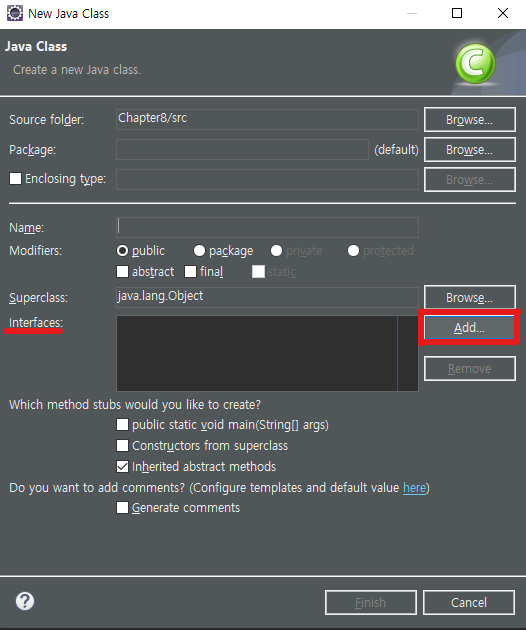

# 💡 상속 (이어서)

## 4. 추상 클래스

* 추상 클래스는 실체 클래스들의 공통되는 필드와 메소드를 정의한 클래스이다.
* 실체 클래스의 부모 클래스 역할을 하기 때문에 new연산자를 사용해서 객체를 직접 생성하지 못하고 상속으로 자식 클래스만 생성할 수 있다.
* 추상 클래스는 `abstract`를 붙여서 클래스를 선언한다.

```java
// 추상 클래스 선언
public abstract class 클래스 {
    필드;
    생성자;
    메소드;
}
```

### 추상 클래스의 용도

* 실체 클래스의 공통 필드와 메소드 이름 통일
  * 여러 개발자가 한 클래스를 사용하면 각각 다른 이름을 사용할 수 있는데 하나로 통일해서 사용하도록 할 수 있다.
* 실체 클래스 작성 시간 절약
  * 공통적인 필드와 메소드를 추상 클래스에 선언하고 실체 클래스마다 다르게 사용해야 하는 것만 따로 선언하면 시간이 절약된다.
* 실체 클래스 설계 규격을 만들고자 할 때
  * 여러 개의 클래스를 만들어야 할 때 동일한 필드와 메소드는 추상 클래스로 하는 설계 규격을 만드는 것이 좋다.

### 추상 메소드와 오버라이드

* 추상 메소드는 추상 클래스를 선언할 때처럼 `abstract`를 붙여서 선언한다.
* 추상 메소드에는 실행문이 담긴 중괄호(`{}`)가 없다.
* 추상 클래스를 단순히 상속만 받으려면 자식 클래스도 추상 클래스가 되어야 하지만, 추상 클래스 내부에 선언한 추상 메소드를 자식 클래스에서 **오버라이드**하면 자식 클래스는 실체 클래스로서 부모인 추상 클래스의 메소드를 상속받아 구현하여 사용할 수 있다.

```java
// 추상 클래스 예제
abstract class MyObject {
	int n;
	public void method1() {}
	public abstract void method2();
}

class YourObject extends MyObject {  // 추상 클래스를 상속받으려면 자식 클래스도 추상 클래스여야 한다.
// 그러나 자식 클래스를 추상 클래스로 하지 않으려면 추상메소드를 override해서 구현해야 한다.
	@Override
	public void method2() {
	}  
}

public class AbstractExample {
	public static void main(String[] args) {
//		MyObject mo = new MyObject();  // 추상 클래스는 인스턴스화(객체화) 불가능
		YourObject yo = new YourObject();  // 상속받아서 추상메소드를 구현한 클래스는 인스턴스화 가능
	}
}
```

# 💡 인터페이스

## 1. 인터페이스의 역할

### 인터페이스?

* 개발자들 사이에서 주고받는 약속으로 사용자 인터페이스를 말하는 것이 아니다!
* 개발 코드와 객체가 서로 통신하는 접점이며, 개발 코드를 몰라도 인터페이스의 메소드만 알면 🆗
* 인터페이스는 한 번에 여러 개를 상속받아 사용할 수 있다.
* 인터페이스도 `instanceof`로 상속여부를 확인할 수 있다!

### 인터페이스의 역할

1. 개발 코드가 객체에 종속되지 않게 해주어서 객체를 쉽게 교체 가능하게 해준다.
2. 개발 코드를 변경하지 않아도 리턴값이나 실행 내용이 다양해질 수 있다. ➡ *다형성 구현!*

## 2. 인터페이스 선언

> **이클립스에서 인터페이스 생성 방법**
>
> 👉 `File` ➡ `New` ➡ `Interface`

* 인터페이스는 무조건 public으로 자동 생성된다!

```java
public interface 인터페이스명 {
    // 상수
    타입 상수명 = 값;
    // 추상 메소드
    타입 메소드명(매개변수, ...);
    // 디폴트 메소드
    default 타입 메소드명(매개변수, ...) {...}
    // 정적 메소드
    static 타입 메소드명(매개변수) {...}
}
```

### 상수 필드

* 인터페이스는 필드 중에서 **상수 필드**만 선언 가능
* 인터페이스 내에 선언한 필드는 모두 자동으로 `public static final`로 생성
* 반드시 선언과 동시에 초기값 지정
* 상수명 선언 규칙
  * 모두 대문자로 작성
  * 여러 단어로 구성된 경우에는 언더바(`_`)로 단어 연결

## 3. 인터페이스 구현

### 3-1. 구현 클래스

#### 구현 클래스 생성

**📌 방법1. 클래스 생성 시 인터페이스 추가**



**📌 방법2. 이미 생성한 클래스의 이름 뒤에 `implements`를 써서 인터페이스 추가**

```java
public class 구현클래스명 implements 인터페이스명 {
    // 인터페이스의 추상 메소드를 override하여 실체 메소드 선언
}
```

#### 인터페이스의 추상 메소드를 구현 클래스의 실체 메소드로 작성하는 방법

* 실체 메소드의 선언부가 추상 메소드와 정확히 일치해야 한다.
* 인터페이스의 모든 추상 메소드는 기본적으로 `public`이므로 더 낮은 접근 제한으로는 작성 불가
* `public`을 생략하면 컴파일 에러가 난다.
* 구현 클래스에 실체 메소드를 작성하지 않으면 구현 클래스가 자동으로 추상 클래스가 되어서 클래스 앞에 `abstract`를 작성해야 한다.
* 앞서 추상 클래스의 추상 메소드를 실체 메소드로 구현하는 것과 같은 방법으로 `Override`를 이용하여 인터페이스의 추상 메소드를 실체 메소드로 구현하면 된다.

> **예제**
>
> ```java
> public interface MessageBean {
> 	public void sayHello(String name);  // interface의 추상 메소드
> }
> ```
>
> ```java
> public class MessageBeanKr implements MessageBean {
> 	@Override
> 	public void sayHello(String name) {
> 		System.out.println("안녕하세요, " + name + "님!");	
> 	}
> }
> ```
>
> ```java
> public class MessageBeenEn implements MessageBean {
> 	@Override
> 	public void sayHello(String name) {
> 		System.out.println("Hello, " + name + "!");
> 	}
> }
> ```

# 💡 중첩 클래스와 중첩 인터페이스

> **중첩 클래스**: 클래스 내부에 선언된 클래스이지만 생성 시 다른 클래스들과 마찬가지로 바이트 코드(`~.class`) 가 만들어진다!
> **중첩 인터페이스**: 클래스 내부에 선언된 인터페이스

## 1. 중첩 클래스의 분류

### 1-1. 멤버 클래스

#### 1️⃣ 인스턴스 멤버 클래스

* A 클래스 외부에서 B 클래스의 객체를 생성하려면 먼저 A 객체를 생성해야 B 객체를 생성하여 사용 가능
* `static`키워드 없이 선언된 클래스로, 정적 필드와 정적 메소드는 선언 불가능

```java
class A {
	class B {  // instance inner class
		B() {}  // 생성자
		int n;  // 인스턴스 필드
		void method() {}  // 인스턴스 메소드
		// static int sn; // static 필드 선언 불가능
		// static void smethod() {} // static 메소드 선언 불가능
	}
}
```

```java
public class InnerClassTest {
	public static void main(String[] args) {
		A a = new A();  // B가 A 안에 있기 때문에 A부터 먼저 생성해줘야 한다
		A.B b = a.new B();
		b.method();
		b.n = 10;
	}
}
```

#### 2️⃣ 정적 멤버 클래스

* C 클래스 외부에서  C 객체를 생성하지 않아도 D 클래스의 객체를 바로 생성 가능
* 모든 종류의 필드와 메소드 선언 가능

```java
class C {
	// static inner class
	static class D {
		D() {}  // 생성자
		int n;  // 인스턴스 필드
		void method() {}  // 인스턴스 메소드
		static int sn;  // static 필드
		static void smethod() {}  // static 메소드
	}
}
```

```java
public class InnerClassTest {
	public static void main(String[] args) {
		C.D d = new C.D();  // static은 C부터 먼저 생성하지 않아도 됨
		d.n = 10;
		C.D.sn = 20;
		C.D.smethod();
	}
}
```

### 1-2. 로컬 클래스

* 메소드 내부에 선언된 클래스
* 메소드가 실행할 때에만 사용할 수 있으므로 메소드 내부에서만 사용 가능
* 메소드 내부에서만 사용되므로 접근 제한이 필요없기 때문에 접근 제한자와 `static`키워드 사용 불가능

```java
public class InnerClassTest {
	// 로컬 클래스 - 밖에서는 쓸 수 없고 이 안에서만 쓸 수 있음
	public static void func() {
		class F {
			F() {}  // 생성자
			int n;  // 인스턴스 필드
			void method() {}  // 인스턴스 메소드
			// static int sn;  // static 필드 선언 불가능
			// static void smethod() {}  // static 메소드 선언 불가능
		}
		F f = new F();
		f.method();
	}
}
```

## 2. 중첩 클래스의 접근 제한

- 멤버 클래스가 인스턴스인지 정적인지에 따라 바깥 클래스의 필드와 메소드에 사용 제한이 있다.

### 2-1. 바깥 필드와 메소드에서 사용 제한

* 인스턴스 멤버 클래스는 바깥 인스턴스 필드와 인스턴스 메소드에서 객체 생성 가능하지만, 정적 필드의 초기값이나 정적 메소드에서는 객체 생성 불가능❌
* 정적 멤버 클래스는 모든 필드의 초기값이나 모든 메소드에서 객체 생성 가능⭕

### 2-2. 로컬 클래스에서 사용 제한

* 자바 7 이전: `final`선언을 하지 않으면 매개 변수와 로컬 변수를 로컬 클래스에 사용 시 컴파일 에러
* 자바 8 이후: 로컬 클래스에서는 `final` 선언을 하지 않아도 매개 변수와 로컬 변수가 자동으로 `final` 특성을 가진다.

### 2-3. 중첩 클래스에서 바깥 클래스 참조 얻기

* 중첩 클래스 내부에서 `this`는 중첩 클래스 내부의 객체 참조
* 바깥 클래스의 객체 참조를 하려면 `바깥클래스명.this`를 사용해야 한다.

## 3. 중첩 인터페이스

* 중첩 인터페이스는 클래스의 멤버로 선언된 인터페이스
  * 해당 클래스와 긴밀한 관계를 맺는 구현 클래스를 만들기 위한 목적
  * 특히 UI 프로그래밍에서 이벤트를 처리할 목적으로 많이 활용

```java
interface DoubleClickable {
	void idclick();
}
class Button {  // 버튼 기능 구현
	Clickable c;
	DoubleClickable dc;
	public void click() {
		System.out.println("클릭");
		if (c!=null) {
			c.iclick();
		}
	}
	public void doubleclick() {
		if (dc!=null) {
			dc.idclick();
		}
	}
	public void addClickListener(Clickable c) {
		this.c=c;
	}
	public void addDClickListener(DoubleClickable dc) {
		this.dc=dc;
	}
	interface Clickable {  // static 속성을 가짐
		void iclick();
	}
}
public class InterfaceExample2 {
	public static void main(String[] args) {
		Button libtn = new Button();
		libtn.addClickListener(new Button.Clickable() {
			@Override
			public void iclick() {
				System.out.println("로그인");	
			};
		});
		libtn.click();
		Button joinbtn = new Button();
		joinbtn.addClickListener(new Button.Clickable() {
			@Override
			public void iclick() {
				System.out.println("회원가입");	
			}
		});
		joinbtn.click();  // 회원가입처리
	}
}
```

## 4. 익명 객체

* 익명 객체는 이름이 없는 객체

* 익명 객체의 특징

  * **단독 생성 불가능:** 클래스를 상속하거나 인터페이스를 구현해야만 생성 가능
  * 사용 위치: 필드의 초기값, 로컬 변수의 초기값, 매개 변수의 매개값으로 주로 대입된다.
  * UI 이벤트 처리 객체 또는 스레드 객체를 간편학 생성할 목적으로 활용한다.

* *보통 자식 클래스를 재사용하지 않아 일회성으로 사용할 객체를 생성할 때 주로 사용!*

* 중괄호(`{}`) 내부에는

  * 익명 자식 객체 생성 시: 필드나 메소드 선언 또는 부모 클래스의 메소드를 오버라이딩 한다. 

    ​									  (⚠  일반 클래스와 달리 생성자 선언 불가능!)

  * 익명 구현 객체 생성 시: 추상 메소드의 실체 메소드를 작성하거나 인터페이스의 메소드를 오버라이딩 한다.

```java
interface IBase {
	void method();
}

abstract class CBase {
	abstract void cmethod();
}

public class AnonymousTest {
	public static void main(String[] args) {
		IBase b = new IBase() {  // 인터페이스를 상속받아서 새로운 클래스(익명 클래스)를 오버라이드하여 생성
			@Override
			public void method() {
				System.out.println("구현 메소드");
			}			
		};
		b.method();  // 호출
		
		CBase c = new CBase() {
			@Override
			void cmethod() {
				System.out.println("추상 메소드도 똒같은겨?");
			}
		};	
		c.cmethod();
	}
}
```

# 💡 예외 처리

## 1. 예외와 오류

- **에러** 👉 하드웨어의 잘못된 동작이나 고장으로 발생한 오류
- **예외** 👉 _사용자의 잘못된 조작 또는 개발자의 잘못된 코딩으로 발생하는 프로그램 오류_

> 📌 그래서 개발할 때 테스트를 하는 것이 중요! 예외 처리는 최대한 개발 당시에 해 둬야 한다.

* 자바에서는 예외를 클래스로 관리한다.

### 예외의 종류

* 일반 예외(Exception)
  * 컴파일러 체크 예외라고도 불린다.
  * 자바 소스를 컴파일하는 과정에서 예외 처리 코드가 필요한지 검사한다.
  * `ClassNotFoundException`과 `InterruptedException` 등이 속한다.
* 실행 예외(Runtime Execption)
  * 컴파일 과정에서 예외 처리 코드를 검사하지 않는 예외
  * `NullPointerException`과 `ArrayIndexOutOfBoundsException` 등이 속한다.

