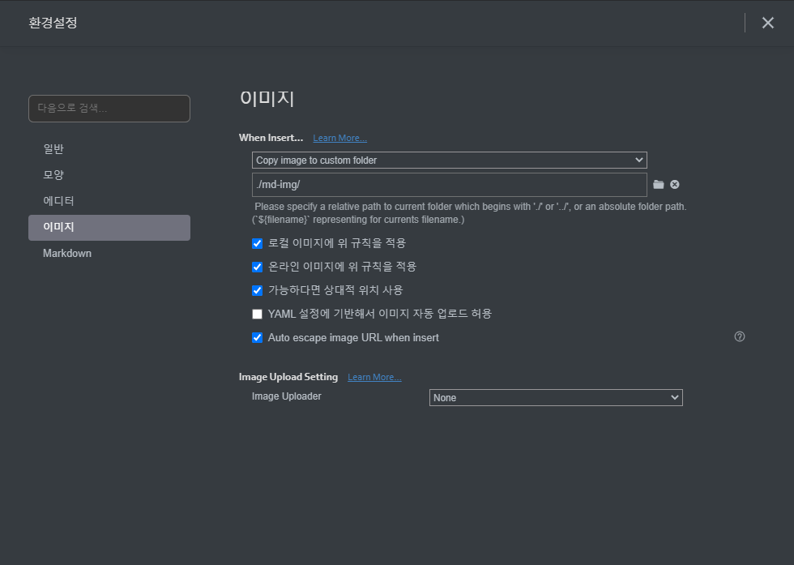

# markdown 문법

## 제목(heading)

#의 갯수를 바탕으로 제목의 레벨을 지정한다.

### 제목3

#### 제목4

##### 제목5

###### 제목6

## 목록

* 순서가 없는
* 목록
  * tab을 눌러서 하위 레벨로
  * 목록을 작성할 수 있습니다.
* 그리고 shift+tab을 통해서 상위 레벨로 갈 수 있습니다.

1. 순서가 있는
2. 목록
   1. 엔터 누르고 tab하면 하위 레벨
      1. 한 번 더
3. shift+tab으로 상위레벨

## 코드 블럭

```java
public class Codeblock() {}
// comment
```

```python
print('hi, codeblock')
# comment
// not comment
```

```html
<h1>
    Title
</h1>
<!-- comment -->
```

```bash
$ git init
```

`inline codeblock`

## 인용문

`>` 를 통해서 인용문을 표현한다.

> 인용문

## 표

| 순번 | 이름   | 비고 |
| ---- | ------ | ---- |
| 1    | 한지민 |      |
| 2    | 한예슬 |      |
| 3    | 최우식 |      |

## 이미지




* typora에서 위의 설정을 하면, 상대경로로 이미지가 관리된다.

## 링크

[구글](https://google.com)에서 검색을 잘하자!

[네이버](https://naver.com)

## 기타

*기울임(이탤릭)*

**굵게(볼드)**

~~취소선~~

---

